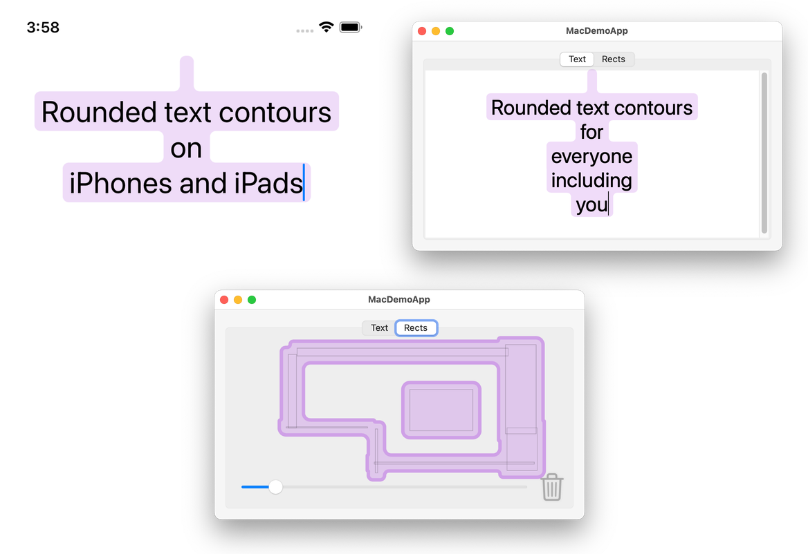

# `RectangleContour`

My main product is a library named `RectangleContour` which contains one Swift module also named `RectangleContour`. The library implements an algorithm for finding the union of a set of axis-aligned rectangles.

Using the library, you can create shapes like these:



## Adding `RectangleContour` as a Dependency

To use the `RectangleContour` library as a dependency in a SwiftPM project, add the following to your `Package` dependencies in your `Package.swift` manifest:

```swift
.package(url: "https://github.com/mayoff/RectangleContour", from: "0.0.2"),
```

and include `"RectangleContour"` as a dependency of your `Target`:

```swift
.target(name: "YourExistingTarget", dependencies: [
    .product(name: "RectangleContour", package: "RectangleContour"),
]),
```

## Demo Apps

To run the demo apps, clone the `RectangleContour` repo and open its `RectangleContour.xcworkspace` in Xcode. Select the `MacDemoApp` scheme and the “My Mac” destination, or select the `PhoneDemoApp` scheme and an iPhone simulator (or real iPhone) destination. Then click Product > Run.

## Using the RectangleContour API

For examples of how to use the module, look for the calls to `contour` and `cgPath` in [`RectDemoView.swift`][2], [`TextDemoView.swift` (macOS)][3], and [`TextDemoView.swift` (iOS)][4].

To use the module, you must first prepare a `Collection` of `CGRect`s. Typically you'll create an array, but you can use any `Collection` type.

```swift
let rects: [CGRect] = [
    CGRect(x: 100, y: 200, width: 300, height: 400),
    CGRect(x: 200, y: 300, width: 500, height: 600),
]
```

Next, ask the collection for its `contour`:

```swift
let contour: IsoOrientedContour = rects.contour()
```

Then you'll probably want to convert the contour to a `CGPath`. The `IsoOrientedContour` type provides two convenience methods for converting a contour to a `CGPath`. One creates sharp corners:

```swift
let sharpPath: CGPath = contour.cgPath()
```

The other creates rounded corners:

```swift
let roundedPath: CGPath = contour.cgPath(cornerRadius: 10)
```

If you need a `SwiftUI.Path` or an `UIBezierPath`, you can wrap the `CGPath`:

```swift
let swiftuiPath = Path(roundedPath)
let uiPath = UIBezierPath(cgPath: roundedPath)
```

## Implementation Notes

This package implements the algorithm described in the 1979 paper [“Finding the Contour of a Union of Iso-Oriented Rectangles”][1] by Witold Lipski Jr. and Franco P. Preparata.

[1]: Lipski-Preparata.pdf
[2]: Sources/MacDemoAppModule/RectDemoView.swift
[3]: Sources/MacDemoAppModule/TextDemoView.swift
[4]: Sources/PhoneDemoAppModule/TextDemoView.swift

